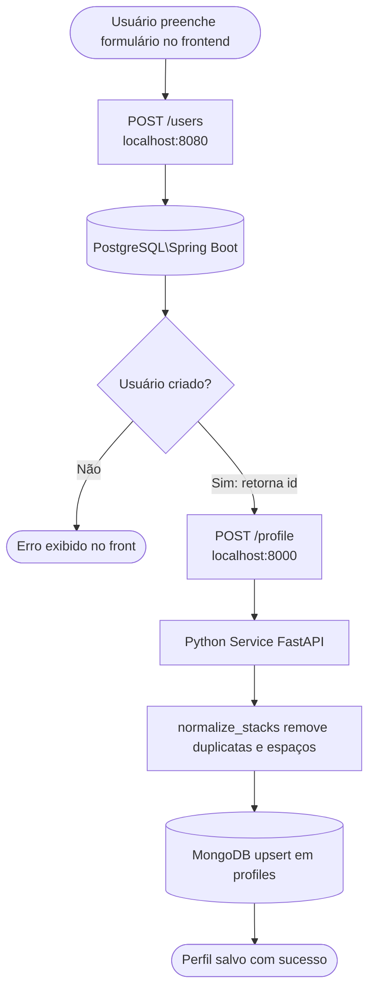

# Python Profile Service

Microserviço Python responsável por receber as **stacks/skills** do usuário vindas do frontend e persistir no **MongoDB**.

---

## Fluxo: Frontend → Python Service → MongoDB



**Payload enviado ao Python Service:**
```json
{
  "profile_id": "42",
  "stacks": ["TypeScript", "React", "MongoDB"]
}
```

---

## Estrutura dos arquivos

```
python-service/
├── app/
│   ├── main.py          # API FastAPI: endpoints e lógica de upsert
│   └── db/
│       └── noSQL.py     # Conexão com MongoDB via Motor (async)
├── script/
│   ├── test2.sh         # Simula payload do frontend e valida persistência
│   └── test.sh          # Script legado (containers isolados, não usar)
├── tests/
│   └── test-data.json   # Dados estáticos usados apenas pelo test.sh legado
├── requirements.txt
└── Dockerfile
```

---

## Endpoints

| Método | Rota                  | Descrição                              |
|--------|-----------------------|----------------------------------------|
| GET    | `/`                   | Status do serviço                      |
| GET    | `/health`             | Verifica conexão com MongoDB           |
| POST   | `/profile`            | Cria ou atualiza perfil com stacks     |
| GET    | `/profile/{user_id}`  | Busca stacks de um perfil por user_id  |

---

## Como testar

### Validar o fluxo completo (script):
```bash
bash python-service/script/test2.sh
```
Simula o exato payload que o frontend envia: faz POST, confirma pelo GET e verifica diretamente no MongoDB.

### Ver os dados persistidos no Mongo manualmente:
```bash
# Todos os perfis
docker exec mongodb mongosh --quiet transcendence \
  --eval "db.profiles.find({},{_id:0}).toArray()"

# Perfil específico
docker exec mongodb mongosh --quiet transcendence \
  --eval "db.profiles.findOne({profile_id:'SEU_ID'},{_id:0})"
```

### Via curl direto:
```bash
# Criar/atualizar perfil
curl -X POST http://localhost:8000/profile \
  -H 'Content-Type: application/json' \
  -d '{"profile_id":"42","stacks":["React","Java"]}'

# Buscar perfil
curl http://localhost:8000/profile/42

# Health check
curl http://localhost:8000/health
```

---

## Variáveis de ambiente

| Variável     | Default                      | Descrição              |
|--------------|------------------------------|------------------------|
| `MONGO_URL`  | `mongodb://localhost:27017`  | URL de conexão MongoDB |
| `DB_NAME`    | `transcendence`              | Nome do banco          |
| `CORS_ORIGINS` | `*`                        | Origens permitidas     |

---

## Sites de estudo

- [python-dotenv](https://medium.com/@habbema/dotenv-9915bd642533)
- [FastAPI em vídeo](https://www.youtube.com/watch?v=R26iojTwUv8&t=99s)
- [API REST conceito](https://www.youtube.com/watch?v=eel1OVIdfUw)